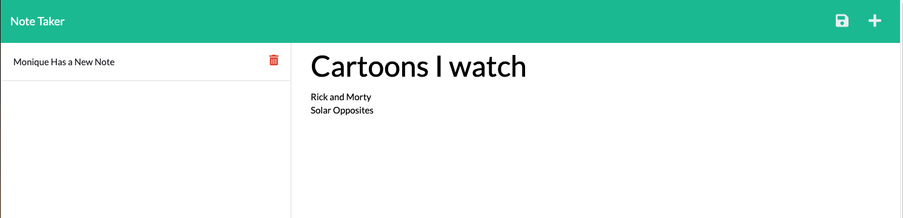

# Note-Taker
*** 
## Description 
The Note Taker is an app that uses an Express backend to save, retrieve, and delete notes from a JSON file. The user starts at the home page shown in the screenshot below:

### Deployment
The URL of the functional, deployed application: https://note-taker-mon-levey-app.herokuapp.com/notes

This app is hosted on Heroku and does not use an external database, so the JSON file that stores the notes is reset every time the server resets.
The URL of the GitHub repository, with a unique name and a README describing the project: https://github.com/monlevey/Note-Taker

#### Techniques and Technologies Used
The HTML, CSS, and frontend JavaScript were provided on this project - I wrote the backend code defining all routes used to make the app work. This app uses Express to handle routing for GET, POST, and DELETE requests. It uses the Node FS module to read the JSON file containing the saved notes, as well as to update the JSON file when notes are added or deleted.

